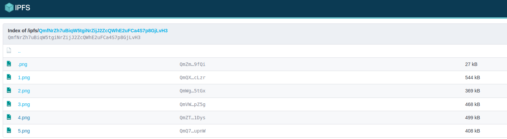

# Uploading content

This guide is a continuation of the minter contract guide and to provide support for uploading content so that it's compatible with the minter contract structure. As explained, ERD-721 is hybrid standard between the native ESDT-NFT and ERC-721 standards. This means that a token  must meet two criteria to be considered a valid ERD-721:

* Provide a base URI where the images are stored
* Provide a base metadata link where attributes are stored

The contract works with any host type, so does the Erdsea platform, so you could teoretically serve images and metadata from your own API. Although this works from a technical standpoint we don't recommend it and highly recommend using decentralized content based storage, such as IPFS or Arweave. This guide will introduce [Pinata](https://www.pinata.cloud), a tool that makes interacting with IPFS user friendly. You can use any other method to upload/manage images and metadata on IPFS.


Mention: Currently Erdsea supports any type of URI that can serve images/metadata and wishes to remain as open and trasparent as possible, but in the future we might flag with a **WARNING** any digital asset that does not serve data from a decentralized storage.&#x20;


## Pinata

Pinata makes interacting with IPFS easy and user friendly. It also backs-up content by pinning it to their IPFS clusters. This is important, because remember, IPFS does not store content unless there are nodes actively pinning it.&#x20;

Pinata is a pay-for-service and offers limited free storage for testing purposes.

## Uploading images

The easiest and recommended way to upload images to IPFS is by creating a folder that holds the images numbered as \[ 1.png, 2.png, ... ]. It's important to have numbered images because the contract assigns indexes when minting tokens. See minting section in [Deployer guide](deployer-contract.md#2.-deploy-contract) for details on base image and metadata URIs.&#x20;

After preparing the images and placing them in a folder, navigate to [https://app.pinata.cloud/pinmanager](https://app.pinata.cloud/pinmanager) and follow the steps.

From the manager console click the + Upload button:&#x20;

.png>)

After clicking, a drop down will pop-up. Choose the Folder option. You should see something similar with this:

.png>)

Click select, browse and choose the folder containing your images. You will be prompted with a message box, click Upload and choose a name for your folder then click Upload:

If everything goes well, the images will uploaded and you should be able to see the created folder in your manager console. Upon clicking on the folder, you should be redirected to the IPFS gateway, showing your folder structure with all the files in it:

.png>)

From this window you can select your base URI. It should follow this form: "gateway/ipfs/CID".

To be more specific, you must append your index value to the an IPFS gateway of your choice (we recommend [https://ipfs.io](https://ipfs.io), but you could also use [https://gateway.pinata.cloud](https://gateway.pinata.cloud)).

From the image above, if we follow the URI form described, we would end up with an image base URI as follows: [https://ipfs.io/ipfs/QmfNrZh7uBiqW5tgiNrZijJ2ZcQWhE2uFCa4S7p8GjLvH3](https://ipfs.io/ipfs/QmfNrZh7uBiqW5tgiNrZijJ2ZcQWhE2uFCa4S7p8GjLvH3). By simply appending the index of the image you can load that particular image.

## Uploading metadata

Similarly to uploading images, you need to create a folder that contains the attributes in json format and upload to IPFS.&#x20;

**Remember**: The number representing an image should be the same with its corresponding metadata. For image 12, you would need the corresponding attributes file 12. For more info on the general format and structure of the attributes visit [metadata structure](erd-721-standard.md#erc-721-structure) section.


Warning: When preparing the attributes files, regardless of the method you use to generate them, make sure the files contained by the folder do not have a **.json **extension, otherwise the contract will produce a wrong metadata link format.


Once your attributes files are created and placed in a folder, you are ready to upload. In order to upload, follow all steps described above in the Uploading images section. After uploading you should see your folder. Upon clicking on it, you will be redirected to the IPFS gateway where you should be able to see your files:

.png>)

Getting the base metadata link from here becomes easy. Follow the same form described for image base URI and you will get your metadata link. In this case, from the image above we end up with: [https://ipfs.io/ipfs/QmdMjaSfmXT4oR9ravmNhNkA3MUfZjcgjfaBEcA4kbVGpz](https://ipfs.io/ipfs/QmdMjaSfmXT4oR9ravmNhNkA3MUfZjcgjfaBEcA4kbVGpz).

To test everything worked fine, try to load some images and their metadata by appending the image/metadata index. An example would be:

* image: [https://ipfs.io/ipfs/QmfNrZh7uBiqW5tgiNrZijJ2ZcQWhE2uFCa4S7p8GjLvH3/1.png](https://ipfs.io/ipfs/QmfNrZh7uBiqW5tgiNrZijJ2ZcQWhE2uFCa4S7p8GjLvH3/1.png)
* metadata: [https://ipfs.io/ipfs/QmdMjaSfmXT4oR9ravmNhNkA3MUfZjcgjfaBEcA4kbVGpz/1](https://ipfs.io/ipfs/QmdMjaSfmXT4oR9ravmNhNkA3MUfZjcgjfaBEcA4kbVGpz/1)
